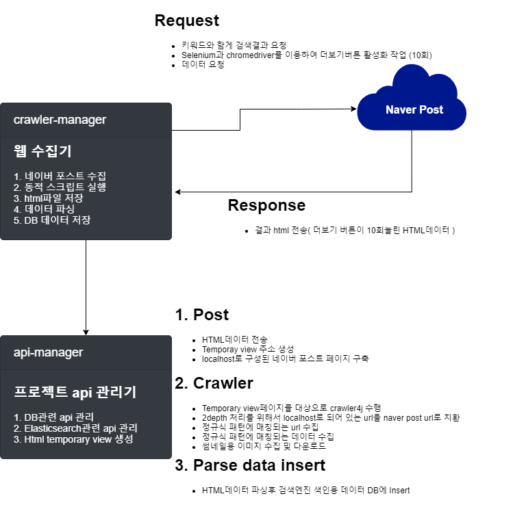

#소개
* Fun.D 사이드 프로젝트인 Flio 중고 마켓 시장에서 사용될 네이버 포스트 수집기이다.
* 해당 프로젝트는 상업성이 아니고 학습용이므로 데이터가 많은 네이버 포스트를 수집대상으로 결정. (상업적으로 절대 이용 X)
  * 네이버 포스트는 기본적으로 로봇이 수집하면 안되는 사이트이므로.
  

# 사용 기술  
__`Selenium`을 사용한 이유__
> * 네이버포스트에서는 기본적으로 로봇의 크롤링을 허용하지 않는다.
> * 또한 보안이 2중으로 되어 있는데 보안은 다음과 같다.
>   * 로봇 수집 비허용
>   * Jsoup처럼 find element로 데이터를 파싱하는 라이브러리에 대한 방지 (SEDOC)
> * 해당 데이터를 사이드프로젝트 목적으로 수집하기 위해서 보안이 되어있음에도 데이터를 수집하였는데 방식은 다음과 같다.
>   * `cralwer4j` 로봇 수집 허용 부분 설정을 false로 변경
>   * element단위로 데이터를 수집하는것이 아닌 정규식으로 패턴이 매칭되는 부분을 처리
> * 네이버포스트의 경우 페이징이 없고 스크롤을 하단으로 내렸을 경우에만 추가적인 데이터가 보여진다.
> * 정적수집 라이브러리인 `crawler4j`만 가지고는 제대로 된 데이터 수집이 불가능하다고 판단, `selinium`을 이용한다.
>   * `selinium`의 동적 이벤트 처리 기능을 이용하여 더보기 버튼을 여러번 처리된 데이터를 가지고 해당 데이터가 전체적인 데이터로 판단하여 처리한다.
>     * 키워드에 대한 데이터는 많이 있지만 최대 10회의 더보기버튼을 클릭한 데이터를 전체데이터로 가정하고 수집한다.
>     * 추가되는 데이터의 경우 `최신순`으로 정렬된 데이터를 가져온다면 증분되는 데이터를 가져올 수 있을 것이라 판단된다.

[crawler4j](https://github.com/yasserg/crawler4j) `웹크롤러`
> Java에서 웹크롤링을 가능하게 하는 라이브러리.  
> 단, 정적표현만 가능하고 동적인 이벤트 처리를 할 수가 없다.  
> `selinium`과의 연계를 위해 WebCrawler.java와 CrawlerFactory.java를 조금 수정하여서 Custom을 하였다.
```
//Crawler 4j
compile("edu.uci.ics:crawler4j:4.4.0")
//Jsoup
compile("org.jsoup:jsoup:1.5.2")
```

[selenium](https://www.selenium.dev/) `동적이벤트`
> UrlConnection으로 가져온 HTML의 데이터를 토대로 원하는 이벤트를 가능하게 해주는 라이브러리.  
> 해당 프로젝트에서는 '더보기' 버튼을 동적 이벤트로 발생하여서 보다 많은 데이터를 수집할 수 있도록 한다.
```
//Selenium
implementation("org.seleniumhq.selenium:selenium-java:3.141.59")
```

# 전체적인 흐름도


# 프로세스 Flow
* OS에 맞는 `크롬드라이버(chromedriver)` 설정
* 네이버포스트검색URL로 데이터 가져오기 `https://post.naver.com/search/post.nhn?keyword=#keyword#`
```java
/**
 * WebDriver 객체 생성
 */
ChromeDriver driver = new ChromeDriver( options );
/**
 * 웹페이지 요청
 */
driver.get(searchUrl);
```
* 네이버 포스트 데이터에서 더보기 버튼 활성화
```java
 javascriptExecutor.executeScript("arguments[0].click();", driver.findElement(By.xpath("//*[@id=\"more_btn\"]/button")));
```
* 만들어진 데이터를 api-manager로 전송하여 localhost의 tempory-view페이지를 구축한다.
```java
RestTemplate restTemplate = new RestTemplate();
HttpHeaders headers = new HttpHeaders();
headers.setContentType(MediaType.APPLICATION_FORM_URLENCODED);
MultiValueMap<String, String> map= new LinkedMultiValueMap<String, String>();
map.add("htmlData", crawlData);
HttpEntity<MultiValueMap<String, String>> request = new HttpEntity<MultiValueMap<String, String>>(map, headers);
ResponseEntity<String> response = restTemplate.postForEntity( saveUrl, request , String.class );
```
* localhost view url로 crawler4j 설정에 추가한다.
```java
crawlController.addSeed(viewUrl);
```
* 2depth 데이터는 없는 주소(localhost로 연결된 주소)를 네이버 포스트 주소로 변경한다.
```java
webURL.setParentUrl("https://post.naver.com");
webURL.setURL(webURL.getURL().replace("http://localhost:8080", "https://post.naver.com"));
```
* 정규식으로 데이터를 파싱하고 HTML태그를 제거하여 DB에 INSERT한다.
```java
 /**
* 내용 추출
*/
Pattern pat = Pattern.compile(crawlerProperties.getSeedInfo().getSearchDataPattern());
Matcher match = pat.matcher(htmlElement.toString());
while (match.find()) {
    String matchData = match.group()
            .replaceAll(crawlerProperties.getSeedInfo().getSearchDataRemoveFront(), "")
            .replaceAll(crawlerProperties.getSeedInfo().getSearchDataRemoveBack(), "");
    content += removeTag(matchData.trim()).replace("&nbsp;"," ")  + " ";
}
```